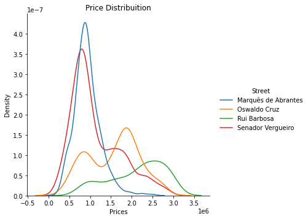

# Regressão: Estimando o valor de venda de um imóvel
Esse é um projeto completo de data science. Inclui etapas como data Scrapping com BeautifulSoup no [zapimoveis.com.br](https://www.zapimoveis.com.br/), tratamento de missing data, análise exploratória de dados, modelagem, otimização dos hiperparâmetros e explicação das decisões do modelo.

Nessa página você encontra um resumo do projeto. A versão completa está separada nos arquivos [zap scrapping.ipynb](zap%20scrapping.ipynb), [data wrangling.ipynb](data%20wrangling.ipynb), [EDA.ipynb](EDA.ipynb) e [zap-modelling.ipynb](zap-modelling.ipynb).

## Business: qual é a utilidade do projeto?
Nosso cliente possui um imóvel situado na Avenida Oswaldo Cruz, Flamengo, RJ. Ele está avaliando se coloca o imóvel à venda. Para ajudar na tomada de decisão, quer saber qual é o valor de venda desse imóvel.

Para responder a essa pergunta, coletamos dados no [zapimoveis.com.br](https://www.zapimoveis.com.br/) sobre outros apartamentos à venda na mesma região, e treinamos um modelo de Gradient Boosting para prever o valor do imóvel, com base em informações como área do imóvel, logradouro, número de quartos e vagas de garagem.

Nosso modelo ótimo alcançou um erro absoluto médio aproximado de R$150 mil. Para dar dimensão, a média do valor dos imóveis em nosso data set é de R$1,5 milhão.

A previsão que o modelo fez para o imóvel de nosso cliente foi de R$1,18 milhão.

## Resumo do Projeto
* Objetivo: criar um modelo de previsão da probabilidade de uma reserva de hotel ser cancelada.
* Nosso modelo xgboost final alcançou um recall de 92% em data points nunca vistos por ele.
* Dados: 80 mil reservas de um hotel situado em Lisboa, Portugal.
* Análise exploratória de dados mostrou que a renda é o fator mais relevante para a previsão da nota.
* Feature engineering: criei duas features novas: uma que indica a renda per capita (por residente no domicílio) do candidato e outra que indica a escolaridade máxima entre pai e mãe.
* Benchmark model com XGBoost e LightGBM para análise de importâncias relativas entre features e feature selection.
* Refinamento do modelo: procura por hiperparâmetros ótimos usando bayesian search.
* Interpretação do modelo: expliquei quais são as decisões que o modelo faz para chegar a uma previsão. Para isso, usei valores SHAP.
* Deploy serverless do modelo no [AWS Lambda](https://aws.amazon.com/lambda/) e criação de um [bot do Telegram](https://telegram.org/blog/bot-revolution) que permite que qualquer pessoa faça a previsão da sua nota no ENEM usando nosso modelo.

## Recursos utilizados
**Python**: Versão 3.7 
**Pacotes Python**: beautifulsoup, numpy, pandas, matplotlib, seaborn, xgboost, hyperopt, joblib, shap 
**Bayesian optimization**: [[1]](https://towardsdatascience.com/automated-machine-learning-hyperparameter-tuning-in-python-dfda59b72f8a) [[2]](https://docs.aws.amazon.com/sagemaker/latest/dg/automatic-model-tuning-ex.html) 
**Explicando o modelo com SHAP**: [[1]](https://medium.com/@gabrieltseng/interpreting-complex-models-with-shap-values-1c187db6ec83) [[2]](https://towardsdatascience.com/shap-explained-the-way-i-wish-someone-explained-it-to-me-ab81cc69ef30) [[3]](https://towardsdatascience.com/black-box-models-are-actually-more-explainable-than-a-logistic-regression-f263c22795d) [[4]](https://towardsdatascience.com/explain-your-model-with-the-shap-values-bc36aac4de3d)

## Obtenção dos dados
Para obter os dados, fizemos data scrapping no site de classificados de imóveis [zapimoveis.com.br](https://www.zapimoveis.com.br/). Utilizamos a biblioteca beautifulsoup, que extrai as informações a partir do HTML da página. O procedimento completo pode ser visto no arquivo [zap scrapping.ipynb](zap%20scrapping.ipynb).

Escolhemos coletar apenas imóveis situados na própria Avenida Oswaldo Cruz ou em ruas próximas, pois seriam estatísticamente próximas ao tipo de imóvel que queremos modelar.

As features que conseguimos extrair são:
|Variável                       |Tipo     |Descrição |
|:------------------------------|:---------|:-----------|
|Price                          |float     | Valor de venda anunciado do imóvel, em R$ |
|Address                      |string    | Logradouro onde o imóvel está situado |
|Area                         |float    | Área do imóvel, em m²|
|Baths                        |int | Quantidade de banheiros no imóvel |
|Condominio             |float | Valor da cota de condomínio do imóvel, em R$ |
|Dorms                       |int    | Quantidade de dormitórios no imóvel|
|IPTU                            |float    | Valor da cota de IPTU do imóvel, em R$ |
|Parking Slots              |int    | Quantidade de vagas de garagem na escritura do imóvel |

Ao final do data scrappping, ficamos com 2889 imóveis em nosso data set.

## Data Cleaning and Wrangling
Após extrair os dados, precisei fazer uma série de transformações para que ficassem apropriados para serem utilizados na análise exploratória e no treinamento dos modelos. Confira a etapa completa em [data wrangling.ipynb](data%20wrangling.ipynb).
* Removi cerca de 790 imóveis que estavam fora da nossa região de interesse. Acabaram aparecendo em nosso data set porque o Zap Imóveis inclui no resultado diversos anúncios patrocinados que não satisfazem os critérios do filtro da busca.
* Diversos valores do data set continham caracteres de formatação indesejados, como os símbolos "\n", "R$" ou "m²". Eliminei esses símbolos, deixando apenas os valores relevantes.
* Todos os nossos valores estavam como string. Converti as features numéricas para datatypes do tipo int ou float.
* Removi 92 linhas duplicadas, que acabaram aparecendo em nosso data set porque anúncios patrocinados são mostrados em mais de uma página do resultado da busca do Zap Imóveis.
* Cerca de 35% dos dados sobre Vagas de Garagem eram nulos. Transformei-os em valores zero. Isso porque, no Zap, apartamentos que não possuem vagas de garagem simplesmente não exibem essa informação no anúncio. Desse modo, nosso scrapper não pôde encontrá-la.
* Removi cerca de 100 apartamentos que não possuíam informações sobre Quantidade de banheiros, quartos, ou valor do condomínio.
* Após o Data Cleaning, ficamos com 1922 apartamentos em nosso data set.

## Análise Exploratória de Dados
Fizemos uma análise exploratória de dados com os 1922 restantes em nosso data set.

Abaixo estão ilustrados alguns insights observados na Análise Exploratória. A análise completa está no arquivo [EDA.ipynb](EDA.ipynb).
* O preço do imóvel (nossa variação dependente) possui assimetria positiva (ver gráfico abaixo). Sua mediana é de R\$ 1,15 milhão.
* Removemos cerca de 160 outliers de preço (imóveis anormalmente mais caros). 90% deles estavam na Avenida Rui Barbosa.
* O Preço do imóvel e sua área têm relação aproximadamente linear, principalmente para apartamentos com até 100m² de área.
* Cerca de 70% dos apartamentos anunciados possuem 2 ou 3 quartos.
* Cerca de metade dos apartamentos anunciados possuem 1 vaga de varagem.
* Apartamentos na Rua Marquês de Abrantes e Senador Vergueiro possuem distribuição de preços similares entre si, mas bastante diferentes dos apartamentos da Avenida Oswaldo Cruz (ver imagem abaixo).
* A distribuição de preços na Avenida Oswaldo Cruz parece ser a superposição de duas distribuições individuais. Análises mais aprofundadas mostraram que essas distribuições são as distribuições de apartamentos de 2 quartos, e de 3 quartos (ver imagem abaixo).

## Modelagem e split dos dados
Usaremos um modelo de Gradient Boosting com a implementação da biblioteca xgboost. O processo completo de modelagem pode ser visto no arquivo [zap-modelling.ipynb](zap-modelling.ipynb).

A feature Street, que informa o logradouro do imóvel, é uma variável categórica. Transformamos essa variável em dummie, criando 11 colunas (uma para cada rua estudada).

Fizemos um split de 70/30% dos dados em conjuntos de treinamento e teste, respectivamente. O conjunto de treinamento será aquele em que ajustaremos os parâmetros treináveis de nosso modelo. Evitamos usar um conjunto dedicado para validação, pois não queríamos diminuir ainda mais nosso training set. Por isso, optamos por usar o N-fold cross validation para otimizar os hiperparâmetros. Já o conjunto de teste será usado uma única vez no final do projeto para estimar a performance que o modelo tem em pontos novos. Desse modo, o conjunto de teste será composto de pontos nunca vistos pelo modelo durante seu treinamento e refinamento.

Na imagem abaixo podemos verificar que as distribuições de preços do conjunto de treinamento e de teste são similares.

## Benchmark
Um modelo inicial foi treinado com xgboost, usando os hiperparâmetros default. 

Nosso modelo de benchmark alcançou um MAE de R$155623 e um RMSE de  R$225648.

## Refinamento do modelo
O processo de refinamento consiste em treinar diferentes modelos, que diferem pelos seus hiperparâmetros, e utilizar nosso conjunto de validação para verificar qual dos modelos faz a melhor previsão. Compararemos a qualidade dos modelos pela métrica MAE, de modo a não punir o algoritmo por errar imóveis cujo preço fosse anormalmente alto ou baixo.

Para buscar os melhores hiperparâmetros, utilizaremos o [Bayesian optimization](https://towardsdatascience.com/automated-machine-learning-hyperparameter-tuning-in-python-dfda59b72f8a). Nesse método, sorteamos aleatoriamente valores para os hiperparâmetros de acordo com uma distribuição de probabilidade. O Bayesian optimization utiliza iterativamente os resultados que vão sendo obtidos para explorar mais intensamente os intervalos de valores mais promissores, para cada hiperparâmetro. Assim, a cada novo modelo treinado, é atualizada a distribuição de probabilidade dos valores associados a cada hiperparâmetro. A implementação do Bayesian optimization que utilizaremos aqui é a do pacote [hyperopt](https://github.com/hyperopt/hyperopt).

Após treinarmos 500 modelos diferentes, o melhor entre eles apresentou um MAE de R$21.563,00 no conjunto de treinamento, média de R$137.915,00 nos conjuntos de validação (utilizando N-fold cv) e R$152.613,00 no conjunto de teste.

O processo completo de refinamento também pode ser visto no arquivo [zap-modelling.ipynb](zap-modelling.ipynb).

## Avaliando Overfitting
Nosso modelo alcançou um MAE de R$21.563,00 no conjunto de treinamento, contra uma média de R$137.915,00 nos conjuntos de validação (utilizando N-fold cv). Isso aponta que nosso modelo tem um certo grau de overfitting, uma vez que sua performance é consideravelmente melhor nos pontos em que foi treinado.

Para minimizar o overfitting podemos otimizar certos hiperparâmetros do XGBoosting com que ainda não trabalhamos, como o subsample. Outra estratégia para combater o problema é aumentar o tamanho de nosso conjunto de treinamento. Testaremos esses caminhos numa próxima etapa de iteração do projeto.

## Interpretação do modelo
Para explicar quais são as decisões que o modelo toma para chegar às previsões, utilizei os valores SHAP, com a implementação da biblioteca [shap](https://github.com/slundberg/shap). Uma explicação sobre o que é o SHAP e a análise completa da explicabilidade de nosso modelo pode ser vista no arquivo [zap-modelling.ipynb](zap-modelling.ipynb).

#### Importância de cada feature na previsão
No gráfico abaixo são mostradas a importância que cada feature tem para a previsão que nosso modelo faz. Notamos que a área é, disparada, a feature mais importante para que nosso modelo faça a previsão de valor de venda de imóvel. Com muito menos importância, mas ainda sim importantes, temos o número de vagas de garagem. Em seguida, com igual importância, temos o valor de condomínio, IPTU, e o fato do imóvel estar (ou não) localizado na Avenida Rui Barbosa. A seguir, com um pouco menos importância, temos o número de banheiros e de dormitórios. As outras features informam se o imóvel está localizado em cada uma das ruas estudadas.

#### Explicando as decisões do modelo
O gráfico abaixo dá uma visão geral das decisões que nosso modelo faz para chegar à previsão de um usuário. Cada linha representa uma feature diferente e deve ser lida separadamente.

Listamos abaixo alguns dos insights obtidos nessa etapa do projeto, incluindo a análise do gráfico acima. A análise completa (e os respectivos gráficos) pode ser vista no arquivo [zap-modelling.ipynb](zap-modelling.ipynb).

* Temos uma correlação positiva: quanto maior é a área do imóvel, maior é a previsão de valor de venda encontrada por nosso modelo.
* Quando não há vagas de garagem (em azul, no gráfico acima), a previsão de valor é diminuída. Quando há 1 vaga (cluster roxo), a previsão é suavemente aumentada. Para mais vagas, temos maiores aumentos na previsão do modelo. Um outro efeito interessante é que, caso o imóvel não possua vagas de garagem, a diminuição na previsão que nosso modelo faz é mais intensa para imóveis de maior área.
* Valores baixos de condomínio tendem a fazer a previsão do nosso modelo diminuir. Em contrapartida, valores altos de condomínio não geram um aumento ou diminuição consistente de previsão do modelo.
* Nosso modelo atribui um valor premium a imóveis localizados na Avenida Rui barbosa. Imóveis que não estão localizados na Rui Barbosa sofrem uma diminuição de previsão de nota, e imóveis que lá estão têm sua previsão aumentada. Um efeito interessante é que apartamentos com grandes áreas sofrem uma penalização maior na previsão de nosso modelo por não estarem localizados na Rui Barbosa, se comparados a imóveis de menores áreas.
* Quanto maior o número de banheiros, maior a previsão de nosso modelo. Outro efeito interessante é que quando um imóvel possui 3 ou 4 banheiros, o aumento da previsão do modelo é mais intenso para imóveis de menor área. Em outras palavras, esses imóveis "compensam" sua menor área pela presença de um banheiro extra.
* Nosso modelo diminui fortemente a previsão de valor para imóveis que possuem apenas um quarto.
